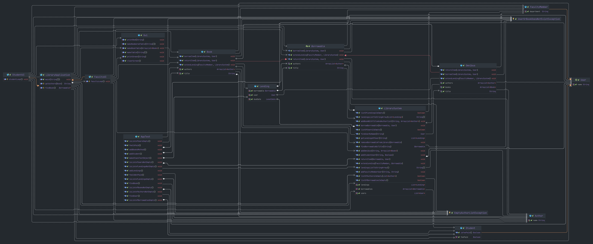

# Design

A composite pattern is used to implement the book and omnibus funtionalities. The atomic object Book and the container
object Omnibus both have a common interface Borrowable.

The class diagram is as follows:

